# ArtisanLink - System Architecture

This document describes the technical architecture of the ArtisanLink platform using Mermaid diagrams.

## Table of Contents

1. [High-Level Architecture](#high-level-architecture)
2. [Database Schema](#database-schema)
3. [Authentication Flow](#authentication-flow)
4. [API Architecture](#api-architecture)
5. [Component Architecture](#component-architecture)
6. [Deployment Architecture](#deployment-architecture)

---

## High-Level Architecture

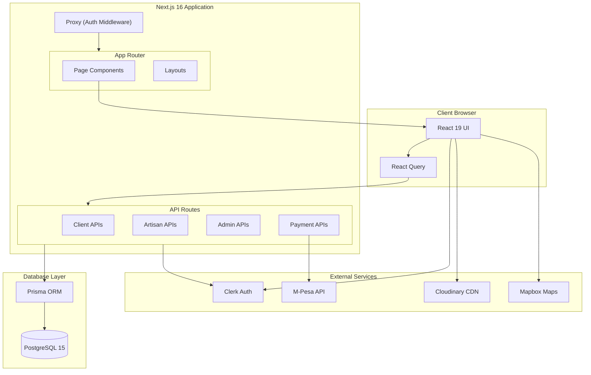

---

## Database Schema

### Entity Relationship Diagram

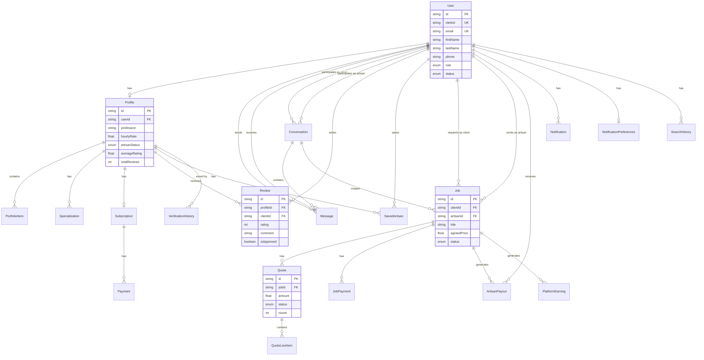

### Core Models Relationships

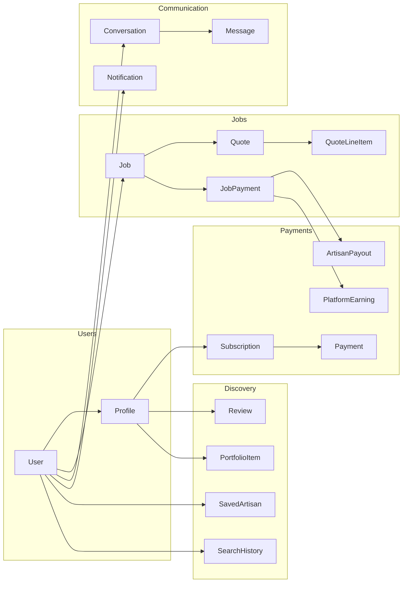

---

## Authentication Flow

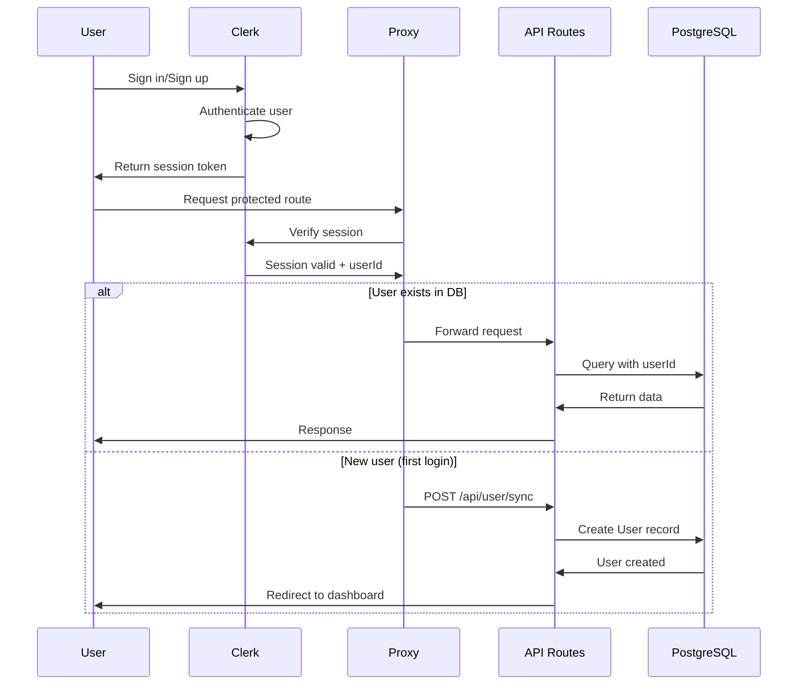

---

## API Architecture

### API Route Structure

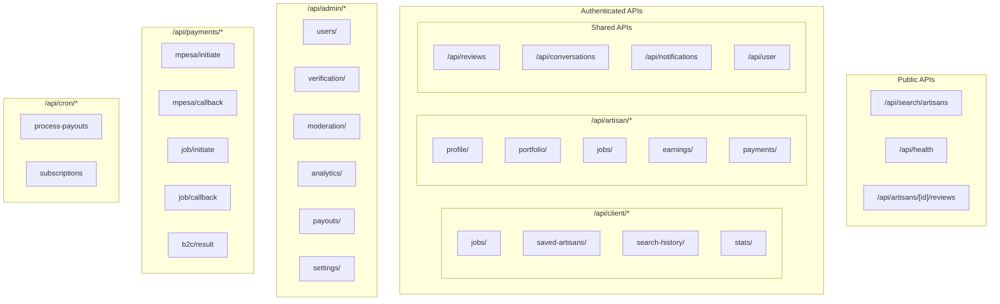

### Request Flow

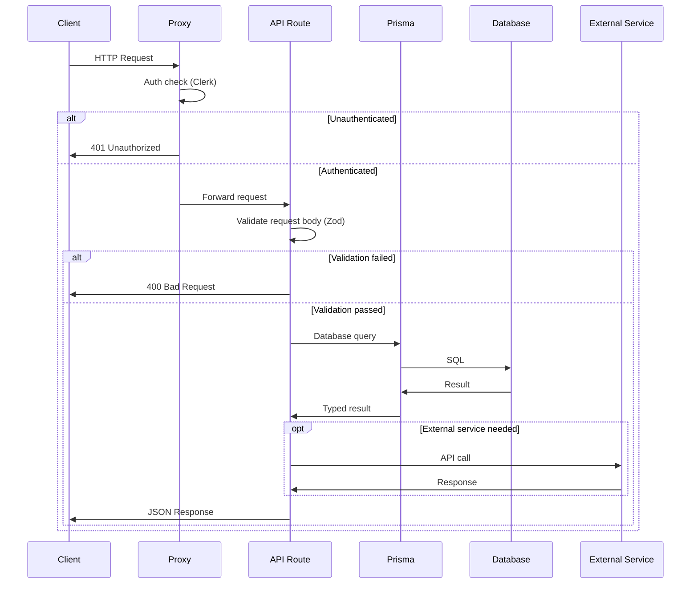

---

## Component Architecture

### Frontend Component Hierarchy

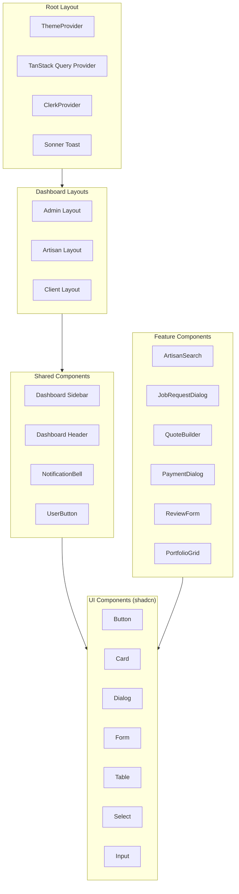

### State Management

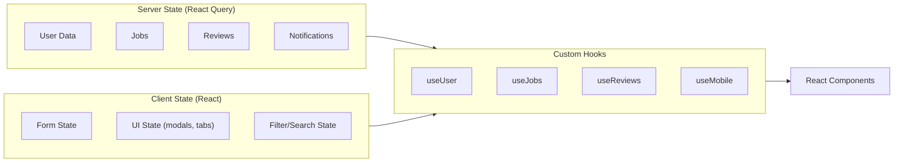

---

## Deployment Architecture

### Production Setup

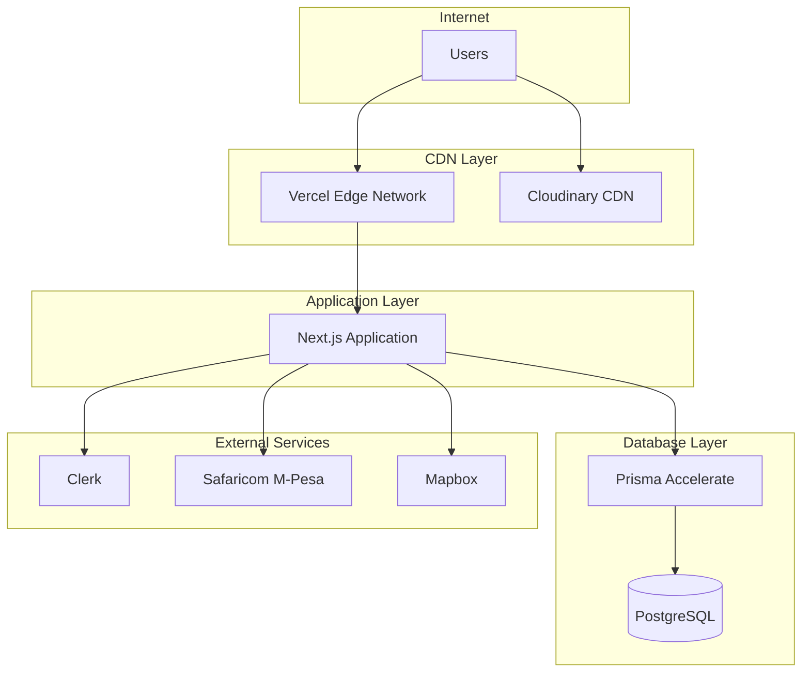

### Environment Configuration

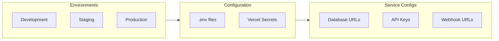

---

## Security Architecture

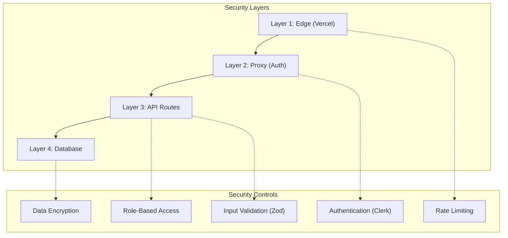

---

## Monitoring & Observability

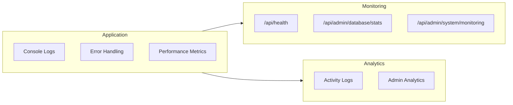
