# ArtisanLink - System Flowcharts

This document contains detailed flowcharts for key processes in the ArtisanLink platform.

## Table of Contents

1. [User Registration & Onboarding](#user-registration--onboarding)
2. [Artisan Verification](#artisan-verification)
3. [Job Request Lifecycle](#job-request-lifecycle)
4. [Quote Workflow](#quote-workflow)
5. [Payment Flow (M-Pesa C2B)](#payment-flow-m-pesa-c2b)
6. [Artisan Payout Flow (M-Pesa B2C)](#artisan-payout-flow-m-pesa-b2c)
7. [Review Workflow](#review-workflow)
8. [Search & Discovery](#search--discovery)
9. [Messaging Flow](#messaging-flow)
10. [Subscription Management](#subscription-management)

---

## User Registration & Onboarding

### Registration Flow

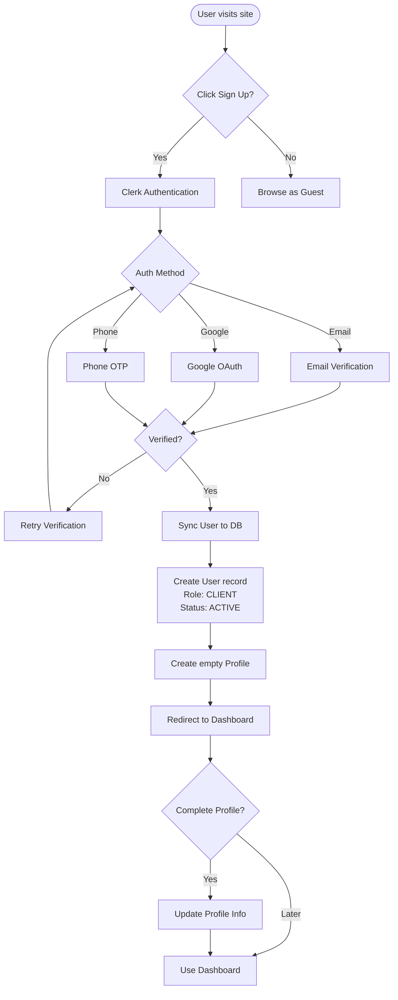

### Role Selection Flow

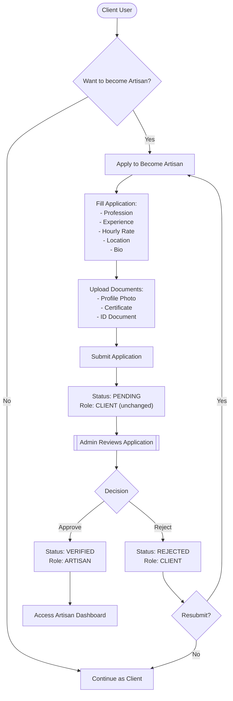

---

## Artisan Verification

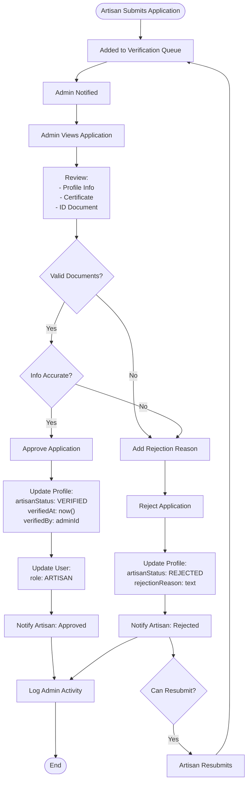

---

## Job Request Lifecycle

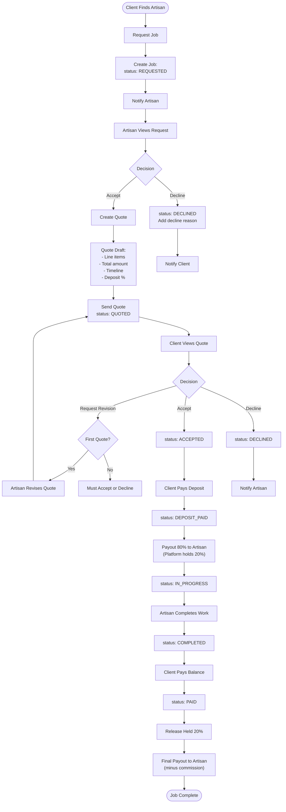

### Job Status State Machine

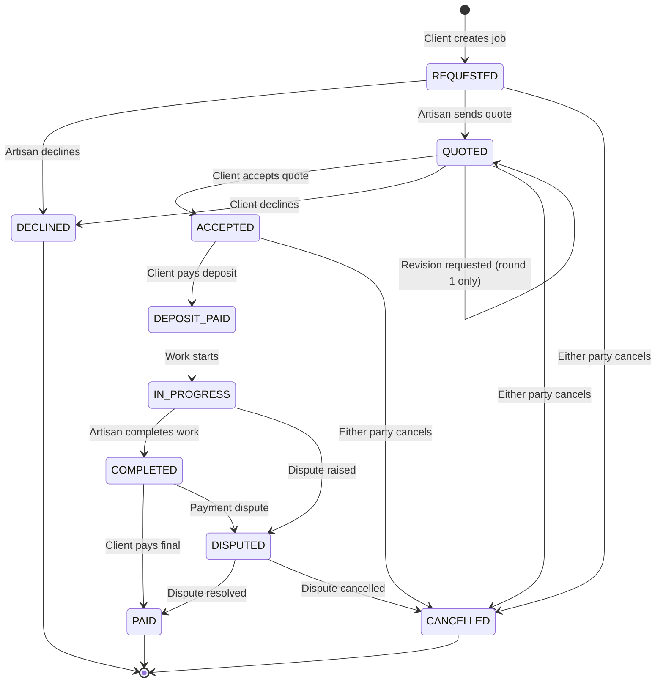

---

## Quote Workflow

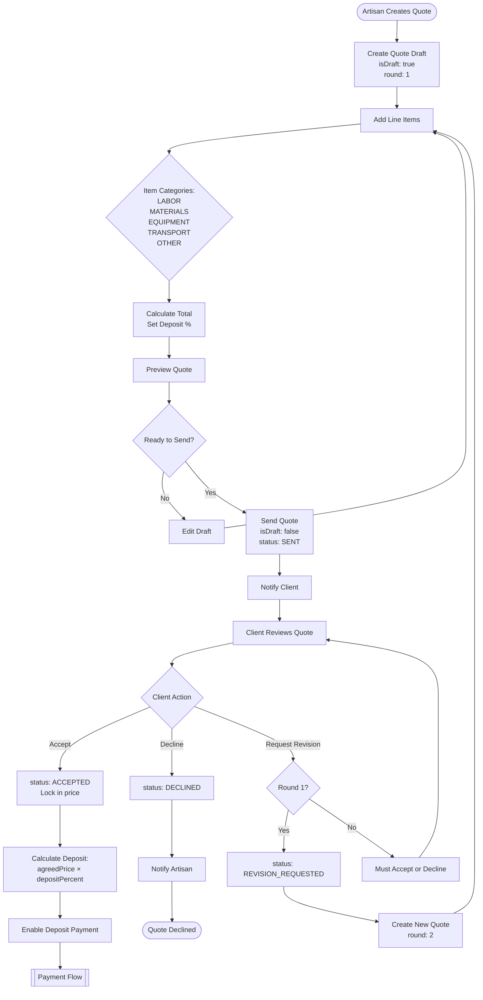

---

## Payment Flow (M-Pesa C2B)

### Deposit Payment

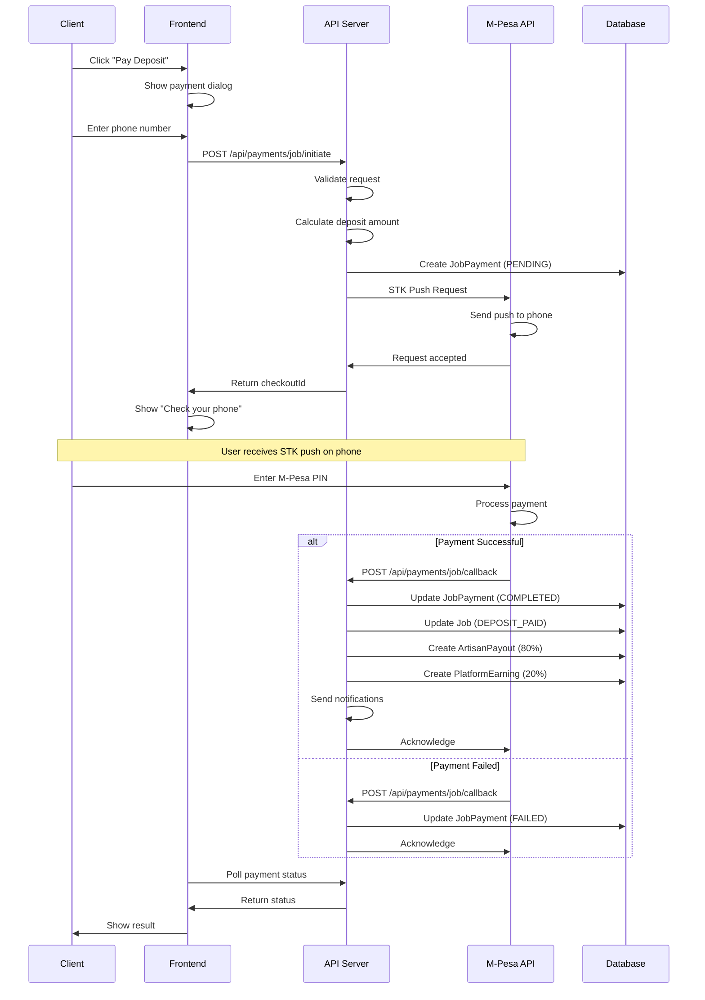

### Final Payment

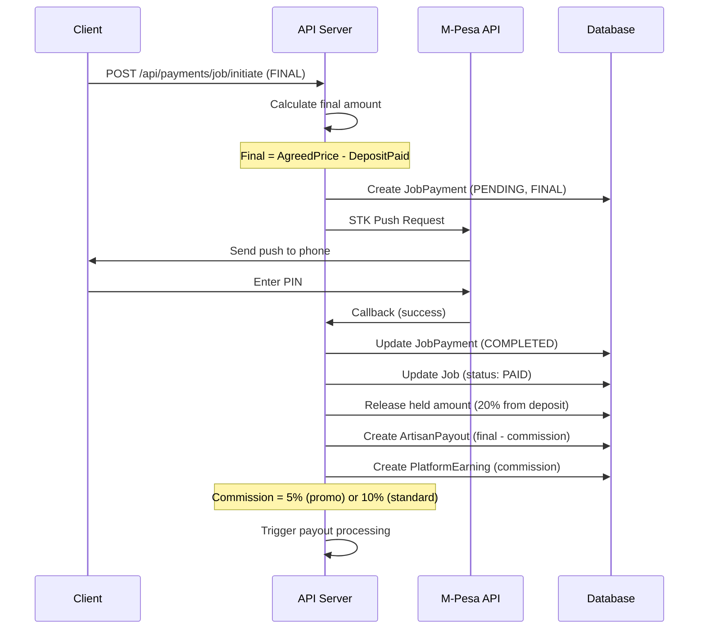

---

## Artisan Payout Flow (M-Pesa B2C)

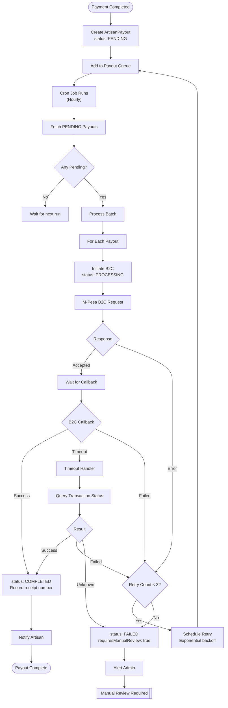

### B2C Sequence Diagram

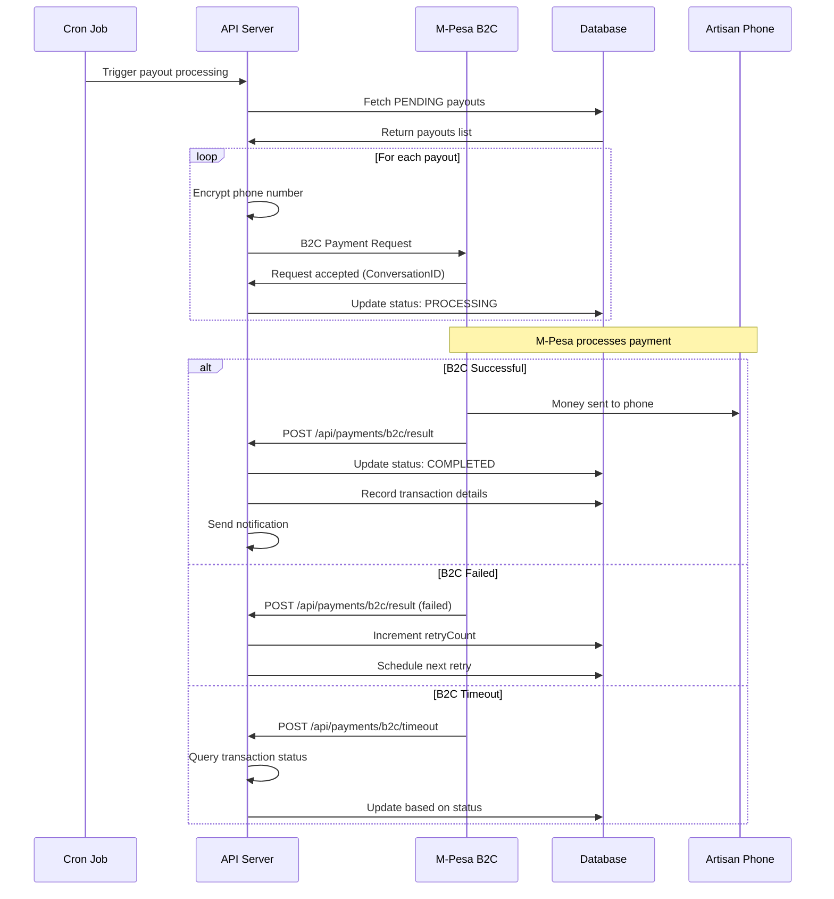

---

## Review Workflow

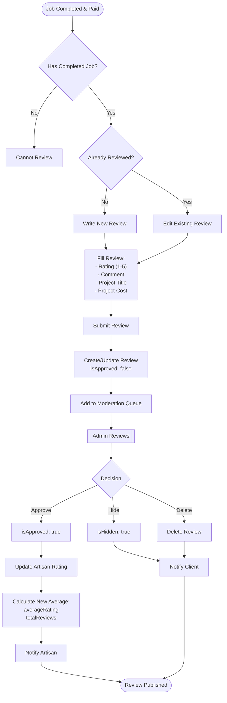

---

## Search & Discovery

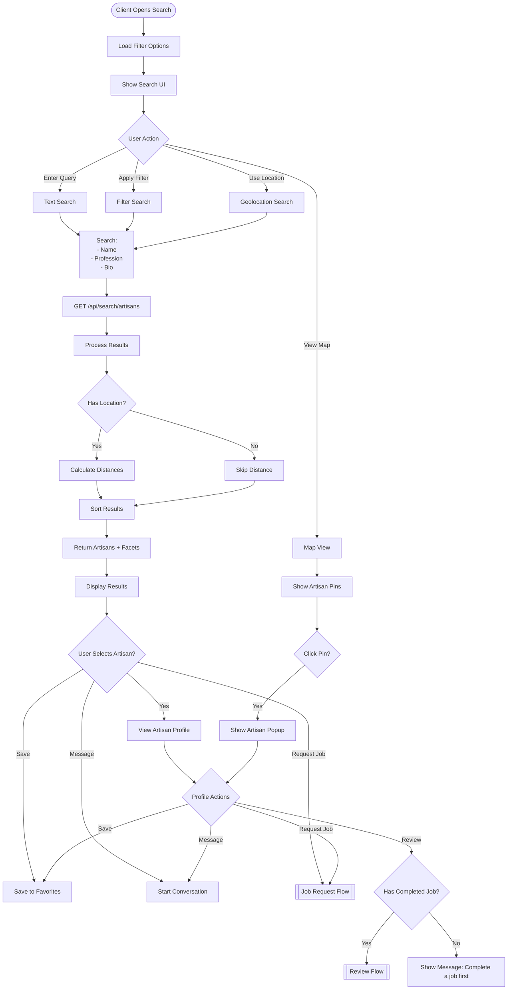

---

## Messaging Flow

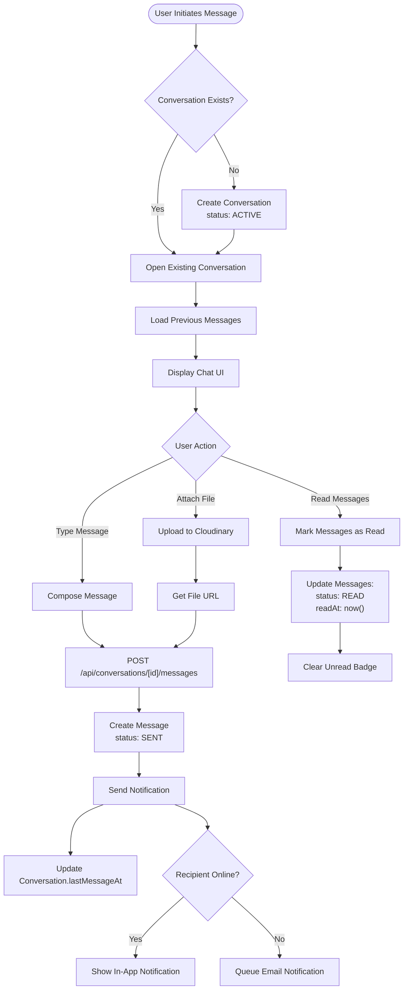

---

## Subscription Management

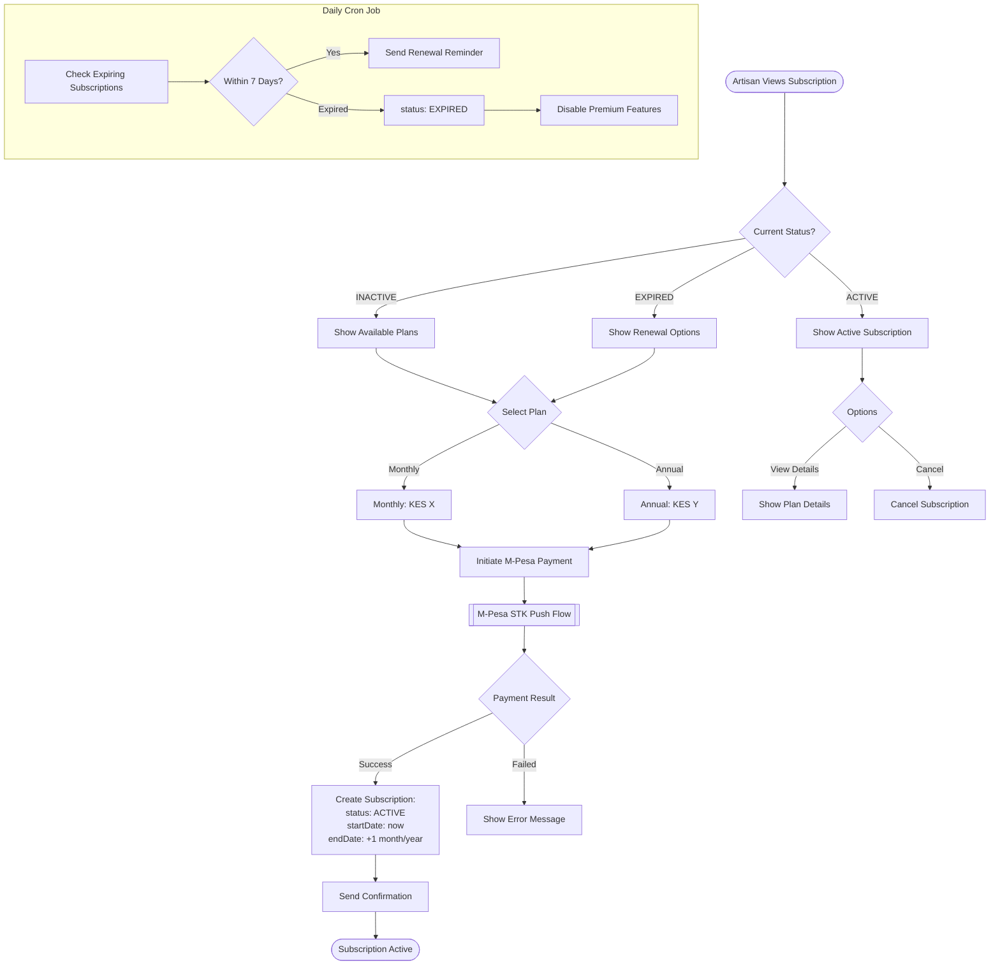

---

## Error Handling Flows

### Payment Error Recovery

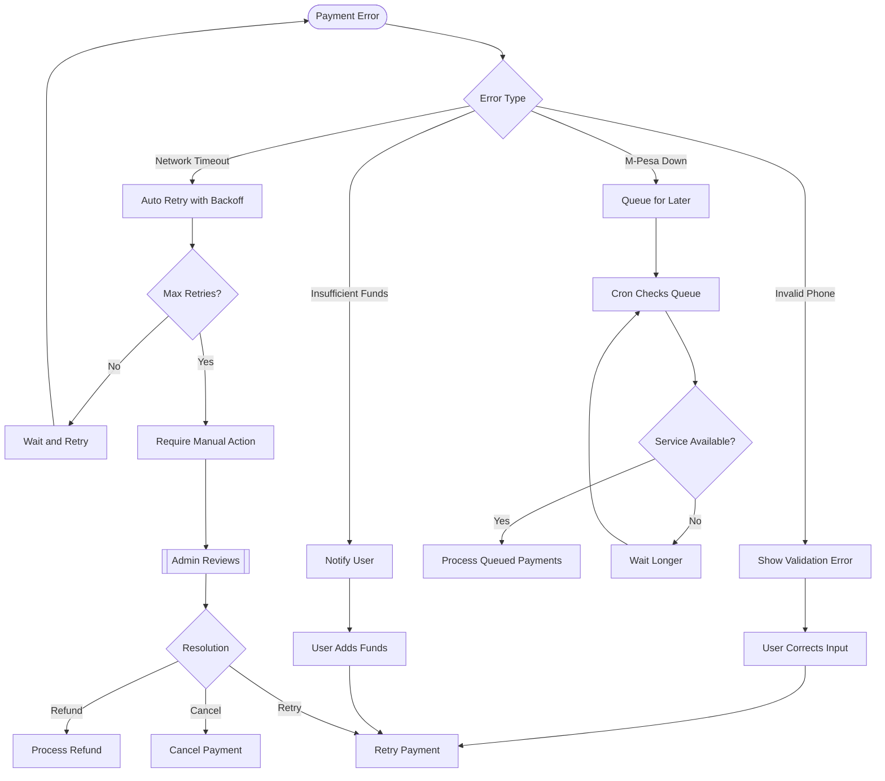
